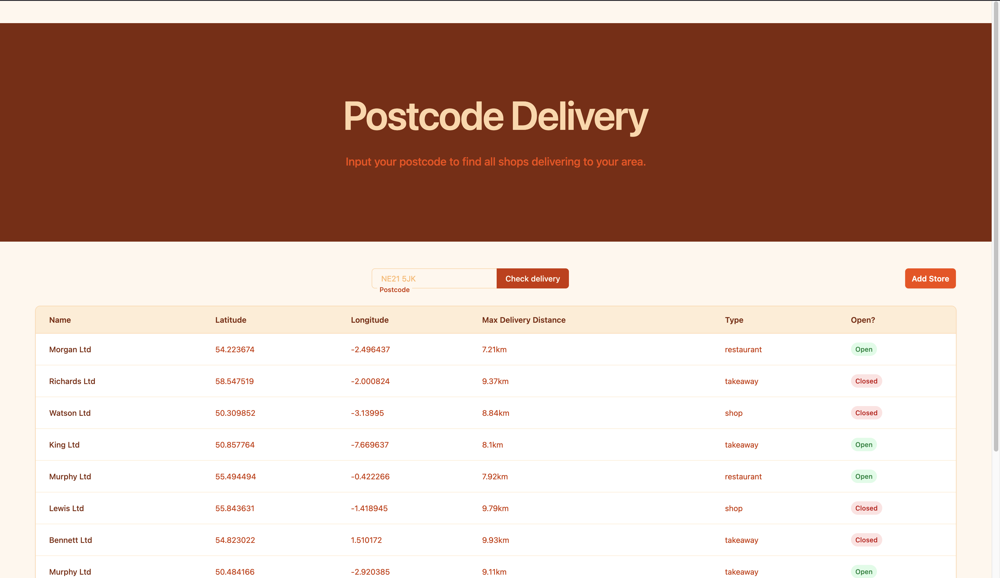

# Postcode Delivery

A simple app that allows users to see stores that deliver to their postcode



## Features

- User can search for stores by postcode
- User can add a new store via create form
- Api route to return stores near to a postcode
- Api route to return stores that can deliver to a postcode
- Console command to download and import UK postcodes

## Prerequisites

Before you begin, ensure you have the following installed on your machine:

- PHP 8.2 or higher
- Composer
- Node.js
- NPM
- sqlite3

## Installation

1. Clone the repository

```bash
git clone https://github.com/relentlesstrout/postcode-delivery
```

2. Navigate to the project folder

```bash
cd postcode-delivery
```

3. Install dependencies

```bash
composer install
```

4. Install Node dependencies

```bash
npm install
```

5. Copy the environment file and configure it

```bash
cp .env.example .env
```

6. Generate your app key

```bash
php artisan key:generate
```

7. Run the Database migration

```bash
php artisan db:migrate
```

8. Run the postcode import command

```bash
php artisan app:fetch-postcodes
```

9. Seed the database

```bash
php artisan db:seed
```

10. Set default search radius for delivery

```dotenv
DEFAULT_DELIVERY_RADIUS_KM=20
```

11. Build front end

```bash
npm run build
```

12. Start the server

```bash
php artisan serve
```

You should now be able to access the app at http://localhost:8000

## Reflections

1. Using a Uk Postcode package would likely include further edge cases than the current regex validation
2. Using livewire or a javascript framework for table updates rather than having a page reload would provide a better UX
3. Using SQLite was a poor choice of database. Lacks the ability to filter with a HAVING clause. MYSQL would be better and PostgreSQL would be best with it's native support for geospacial and geometric objects.
